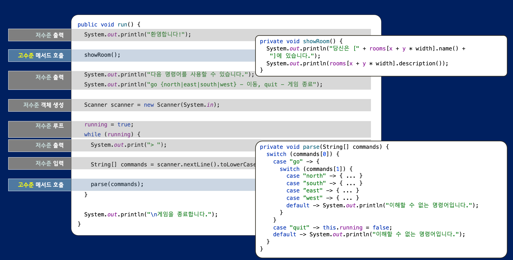
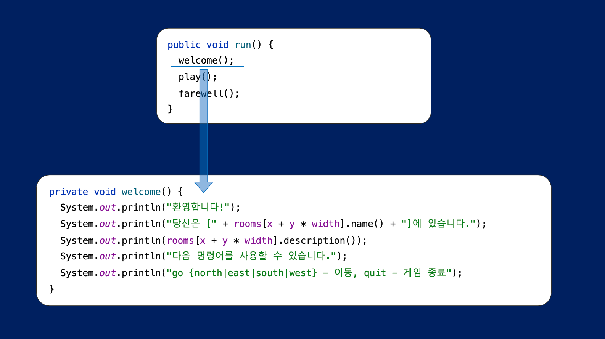
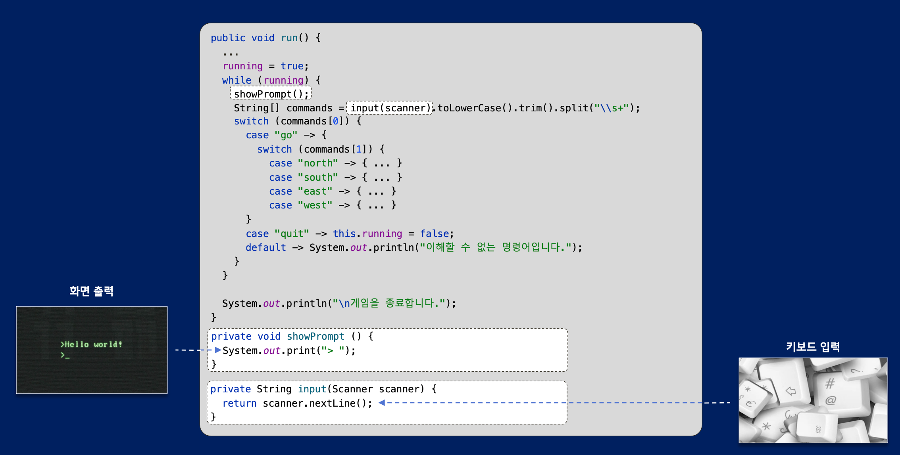
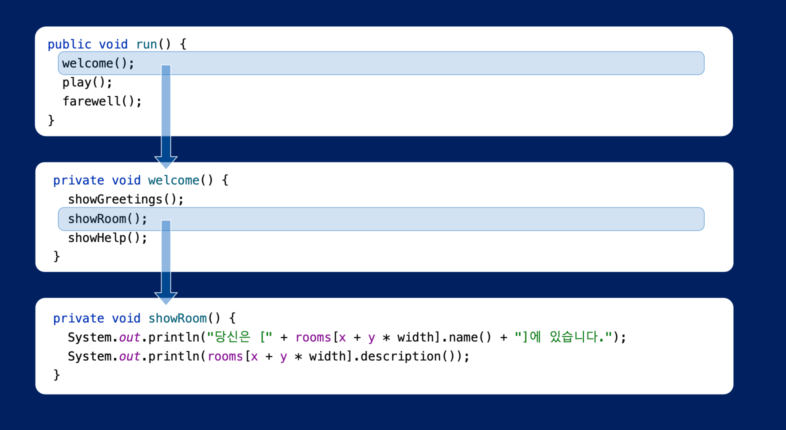
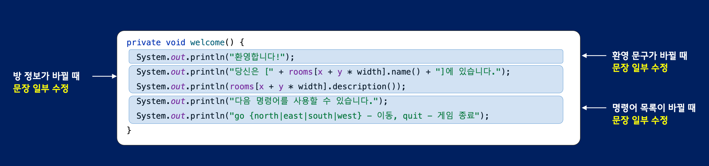

## 단일 추상화 수준 원칙과 조합 메서드

메서드 추출하는 이유 
- 가독성 향상
- 중복 코드 제거
- 불안정한 의존성 고립

### 가독성 향상

고수준 코드와 저수준 코드가 섞여있으면 가독성이 떨어진다.
- 고수준 코드: 달설하려는 목표만 표현하는 경우 (what) 
- 저수준 코드: 목표를 달성하기 위한 구체적인 방법(매커니즘, 알고리즘)을 서술하고 있는 경우 (how) 

- 추상화 수준을 맞추면 세부사항을 모르더라도 메서드의 목적을 이해할 수 있다.
- 이렇게 동일한 추상화 수준에 있는 코드를 조합해서 메서드를 구현하는 방식을 조합 메서드 패턴이라고 한다. 

### 불안정한 의존성 고립

앞서 작성한 코드들은 Scanner, System 같은 외부 디바이스 의존이 존재하는데, 이 때문에 제어 및 테스트 작성이 어려워진다.
직접 제어하기 어려운 클래스에 의존하는 코드들을 별도의 메서드로 추출하면 코드의 유지보수성을 늘릴 수 있다.

언제까지 메서드를 추출해야 하는가?
- 메서드가 오직 한 가지 이유로 변경될 때까지 추출

메서드 수준의 응집도
- 낮은 응집도: 메서드가 여러 가지 이유로 변경이 필요한 경우
- 높은 응집도: 메서드가 한 가지 이유로만 변경될 때 

--- 

리팩터링
- 큰 메서드 -> 작은 메서드 추출 (동일한 추상화 수준으로)
  - 목적과 이름의 유사성을 기반으로 대략적으로 메서드 분류 (그룹 단위로 분류)
- 값 객체로 표현 가능한 부분 확인 (중복되는 부분, 의미를 나타낼 수 있는 부분 찾아보기)
- 단일 책임 원칙을 적용하여 클래스 단위로 나눠보기 

